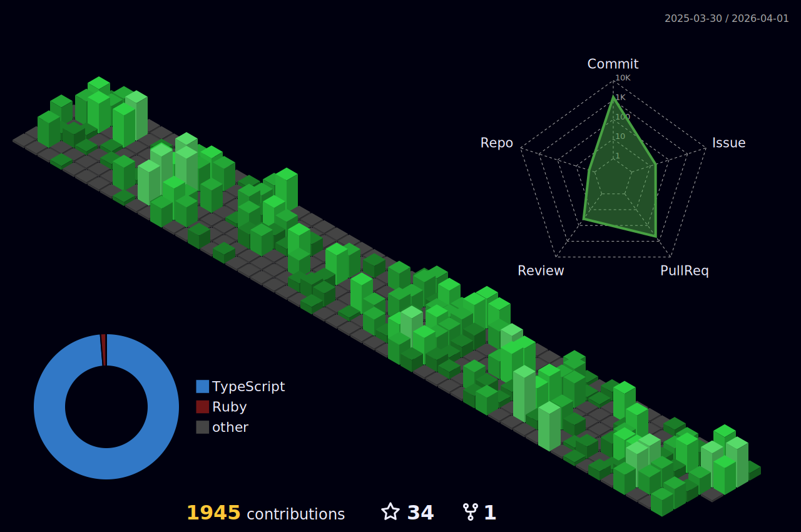

# 💫 About Me:
💻 I am a full-stack software engineer currently working with Ruby on Rails and React with Typescript. 📨 Send me an [e-mail](mailto:shafferlucas@gmail.com) or add me on [LinkedIn](https://linkedin.com/in/lucas-shaffer)

## 🌐 Socials:
 

# 💻 Tech Stack:
                          
# 📊 GitHub Stats:

 
 

### ✍️ Random Dev Quote

---

<!-- Proudly created with GPRM ( https://gprm.itsvg.in ) -->
