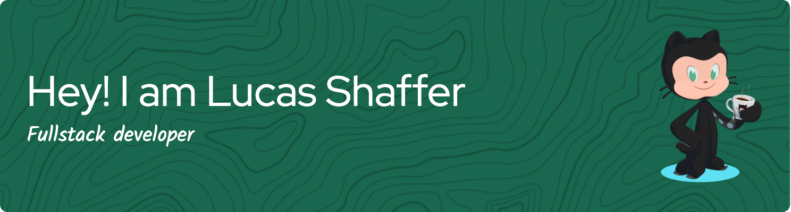
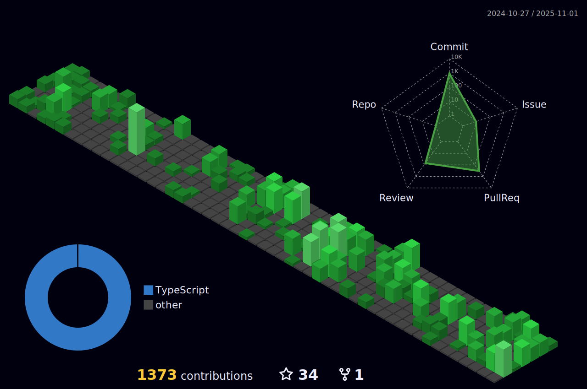

<h1  style="display: flex; align-items: center;"> Hello Fellow < Developers/ >!  </h1>

 Hi! My name is Lucas Shaffer. Thank You for taking the time to view my GitHub Profile :smile:

<h2 style="display: flex; align-items: center;"> About Me </h2>

- 🔭 I’m currently working on a project that allows user to practice behavioral interview questions and get instant feedback using AI.

- 🌱 I’m currently learning Artificial Intelligence and Machine Learning

- 👯 I’m looking to collaborate on Job hunting

- 💬 Talk to me about AI, React, JS, TS, Open Roles.

<h2 style="display: flex; align-items: center;"> Connect with me  </h1>

 

<h2 style="display: flex; align-items: center;"> Skills  </h2>

<h2 style="display: flex; align-items: center;">GitHub Stats  </h2>

 
 

<h2  style="display: flex; align-items: center;"> Some Programming Humor for you </h2>

